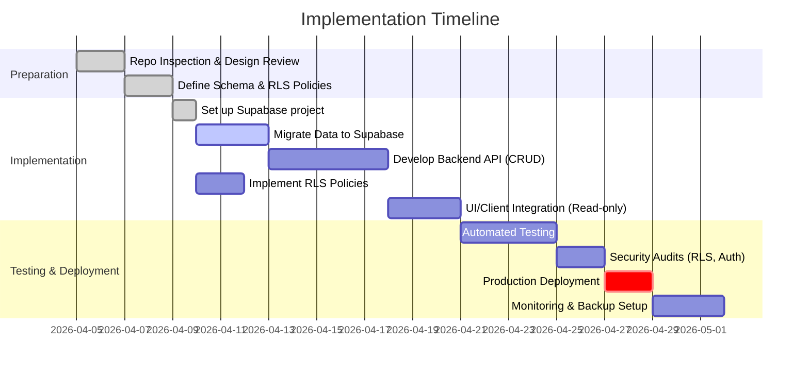

# Executive Summary  
To secure our design artifacts (“.md” and “.json” outputs) so that only the trusted application can modify them, we propose migrating all document storage into a Supabase (PostgreSQL) backend and exposing only a controlled API for writes. In this architecture (Fig. 1), **only the API server** (running under a dedicated service identity) holds write privileges. AI agents or untrusted clients have at most **read-only access** via limited API keys or roles. We enforce *row-level security* (RLS) policies to ensure unauthorized actors cannot update data【62†L200-L207】【59†L87-L94】. Every write (create/update/delete) goes through the API, which validates input and records an audit log or version. The legacy SQLite/SQLAlchemy models are replaced with equivalent Supabase tables (Projects, Documents, Diagrams, API_Endpoints) using JSON/JSONB columns for structured content. The trusted server uses Supabase’s service key or a privileged role to bypass RLS (as needed for writes), while unprivileged tokens or RLS policies prevent agents from writing. We also plan a migration of existing data into these new tables, and implement backup, monitoring, and hardened configuration (SSL, network restrictions, MFA) per Supabase’s production checklist【59†L87-L94】【62†L200-L207】.  

```mermaid
flowchart LR
    A["AI Agents / Clients (unauthenticated)"] -- GET (read) --> API[API Server (Flask)]
    U["User Interface (owner)"] -- GET/POST (authorized) --> API
    API -- Service Role Key --> DB[(Supabase PostgreSQL)]
    SupabaseAuth[(Supabase Auth/RLS)]
    classDef trusted fill:#bbf,stroke:#333,stroke-width:2px;
    class API,DB,SupabaseAuth trusted;
    DB -- Indexed & JSONB storage for projects, docs, diagrams, API endpoints --> Users[(Users & Teams)]
    note right of API: Validates input, enforces\npolicies, logs writes
```  

*Fig. 1: Proposed architecture. All write operations flow through the API server to Supabase. Supabase RLS/Auth enforce that only the service role or authorized users can write. AI agents/clients are restricted to read-only or specific API calls.*  

## Code Inspection: .md/.json in the Existing App  
The current **SoftwareDesignTool** is a Flask app with a SQLite (or optionally PostgreSQL) database. It never writes actual `.md` or `.json` files to disk; instead: documents, diagrams, and API endpoints are stored in DB tables (often as JSON fields) and *exported* as Markdown or JSON when requested via HTTP. Key places where JSON or Markdown are created or used include:  

| File/Route                         | Functionality                             | Operation                           | Format        |
|:-----------------------------------|:------------------------------------------|:------------------------------------|:-------------|
| **`app/models/project.py`**        | `projects` table schema【44†L6-L15】       | Stores project metadata             | (DB record)   |
| **`app/models/document.py`**       | `documents` table schema【14†L9-L17】      | Stores structured docs; `data` field is JSON | JSON (DB) |
| **`app/models/diagram.py`**        | `diagrams` table schema【31†L9-L17】       | Stores diagram nodes/edges as JSON  | JSON (DB)     |
| **`app/models/api_endpoint.py`**   | `api_endpoints` table schema【30†L11-L15】 | Stores API spec with JSON schemas   | JSON (DB)     |
| **`app/routes/projects.py`**       | **Export endpoint** `/api/projects/<id>/export`【4†L63-L72】 | Calls `ExportService.export_json/markdown` to generate files | JSON (API response) or Markdown (download) |
| **`app/export/export_service.py`** | Builds JSON dict and Markdown string from DB rows【6†L8-L16】【6†L103-L112】 | Reads all project artifacts from DB; returns JSON or Markdown text | JSON, Markdown |
| **`app/routes/documents.py`**      | Create/Edit document forms【10†L170-L178】【10†L209-L217】 | Parses form into JSON data and saves via `DocumentService` | (saves JSON in DB) |
| **`app/services/document_service.py`** | CRUD for documents【8†L17-L25】        | Inserts/updates `documents.data` (JSON field) | JSON (DB)     |
| **`app/routes/diagrams.py`**       | `/api/diagrams/<id>` GET/PUT【40†L99-L108】【40†L114-L122】 | Returns diagram JSON; updates diagram `data` | JSON (API)    |
| **`app/services/diagram_service.py`** | CRUD for diagrams【46†L29-L37】        | Inserts/updates `diagrams.data` (JSON field) | JSON (DB)     |
| **`app/routes/api_endpoints.py`**  | Create/Edit API endpoint forms【50†L113-L122】【51†L190-L199】 | Parses parameters/status codes into JSON; saves via service | JSON (DB)   |
| **`app/services/api_endpoint_service.py`** | CRUD for endpoints【49†L17-L26】【49†L33-L42】 | Inserts/updates `api_endpoints.request_schema/response_schema` JSON columns | JSON (DB) |
| **Tests (export)**                 | `tests/test_export.py`【26†L86-L94】【27†L179-L187】 | Verifies JSON structure and Markdown formatting on export | JSON, Markdown |

In summary, the **“files”** in question are really the *data* managed by the app. The app exposes JSON and Markdown outputs (for LLM agents or downloads) but edits all content via forms or APIs that write to the database.  

## Supabase-Backed Design

### Database Schema  
We will create Supabase tables mirroring the above models. Key tables (SQL `CREATE TABLE` snippets) are:

```sql
-- Projects table
CREATE TABLE projects (
  id UUID PRIMARY KEY DEFAULT uuid_generate_v4(),
  name TEXT NOT NULL,
  description TEXT,
  created_at TIMESTAMP WITH TIME ZONE DEFAULT now(),
  updated_at TIMESTAMP WITH TIME ZONE DEFAULT now()
);

-- Documents table
CREATE TABLE documents (
  id UUID PRIMARY KEY DEFAULT uuid_generate_v4(),
  project_id UUID NOT NULL REFERENCES projects(id) ON DELETE CASCADE,
  type TEXT NOT NULL,           -- 'user_story', 'requirement', etc.
  data JSONB NOT NULL DEFAULT '{}'::jsonb,
  created_at TIMESTAMP WITH TIME ZONE DEFAULT now(),
  updated_at TIMESTAMP WITH TIME ZONE DEFAULT now()
);

-- Diagrams table
CREATE TABLE diagrams (
  id UUID PRIMARY KEY DEFAULT uuid_generate_v4(),
  project_id UUID NOT NULL REFERENCES projects(id) ON DELETE CASCADE,
  type TEXT NOT NULL,           -- e.g. 'architecture', 'uml_class', etc.
  name TEXT NOT NULL,
  data JSONB NOT NULL DEFAULT '{}'::jsonb,  -- stores nodes and edges
  created_at TIMESTAMP WITH TIME ZONE DEFAULT now(),
  updated_at TIMESTAMP WITH TIME ZONE DEFAULT now()
);

-- API Endpoints table
CREATE TABLE api_endpoints (
  id UUID PRIMARY KEY DEFAULT uuid_generate_v4(),
  project_id UUID NOT NULL REFERENCES projects(id) ON DELETE CASCADE,
  path TEXT NOT NULL,
  method TEXT NOT NULL,
  description TEXT DEFAULT '',
  request_schema JSONB DEFAULT '{}'::jsonb,   -- stores {parameters, body}
  response_schema JSONB DEFAULT '{}'::jsonb,  -- stores {body, status_codes}
  created_at TIMESTAMP WITH TIME ZONE DEFAULT now(),
  updated_at TIMESTAMP WITH TIME ZONE DEFAULT now()
);
```

*(We assume the Postgres extension `uuid-ossp` is enabled for UUIDs.)* All JSONB columns allow efficient querying. These schemas match the existing SQLAlchemy models【14†L9-L17】【30†L11-L19】.  

### Supabase Auth & Roles  
We will rely on Supabase’s built-in Auth and Postgres roles to enforce access control:
- **Service Role (Privileged)**: The backend API server will use a **Supabase service key** (Env var) to connect. This key bypasses RLS and has full read/write privileges. It must be kept secret on the server (never given to clients).  
- **Authenticated Users**: Not strictly needed if this is single-user/self-hosted. If user accounts exist, enable Supabase Auth. Otherwise, treat all clients as “authenticated” or “anonymous” roles.  
- **AI Agents / Public**: We will not hand out the service key. If any direct DB access is given to agents (e.g. via client library), they should use the **anon/public** role key with RLS policies restricting writes (see below). In practice, we expect all interactions to be via the trusted API, so the public role should have *no* direct insert/update privileges.  

By default, Supabase creates two roles: `authenticated` and `anon`. We will create RLS policies on each table to allow only the `service_role` or specific `authenticated` identities to write. For example:  

```sql
-- Enable RLS on all tables
ALTER TABLE projects    ENABLE ROW LEVEL SECURITY;
ALTER TABLE documents   ENABLE ROW LEVEL SECURITY;
ALTER TABLE diagrams    ENABLE ROW LEVEL SECURITY;
ALTER TABLE api_endpoints ENABLE ROW LEVEL SECURITY;

-- Sample RLS policy for writes: only allow if auth.uid() matches an "owner" (or skip for single-user)
CREATE POLICY "Allow trusted writes" ON projects
  FOR ALL USING ( auth.role() = 'authenticated' /* or a specific claim */ );
-- (If we attach an owner column, e.g. owner = auth.uid(), we could use (auth.uid() = owner) instead.)
```

In our simplest model, we might forego multi-user RLS and simply say: **disable all writes for anon/unauth**, and only allow using the service key. Supabase’s documentation warns: *“Tables without RLS enabled allow any client to access and modify their data. This is usually not what you want”*【59†L87-L94】. By enabling RLS, we ensure even the anon key cannot modify tables until policies are defined.  

### Row-Level Security (RLS) Policies  
We will define RLS policies tailored to our needs. Examples:  

- **Projects Table**:  
  ```sql
  -- Only allow users (or service) to insert/update
  CREATE POLICY project_insert ON projects
    FOR INSERT TO authenticated
    USING (true);
  CREATE POLICY project_update ON projects
    FOR UPDATE TO authenticated
    USING (true);

  -- Optionally, link each project to an owner if multi-user support:
  -- e.g. column owner_id and policy "auth.uid() = owner_id"
  ```

- **Documents/Diagrams/API Endpoints Tables**:  
  ```sql
  -- Allow inserts/updates only via the API server (service_role) or proper authenticated user
  CREATE POLICY doc_insert ON documents
    FOR INSERT TO authenticated
    USING (true);
  CREATE POLICY doc_update ON documents
    FOR UPDATE TO authenticated
    USING (true);

  -- Deny everything else (e.g. DELETE only via API with service_role, not by agents)
  ```

In practice, we’ll likely disable direct DELETE via client roles, forcing deletes through API. If multi-user, each table could have an owner_id and policies like `(auth.uid() = owner_id)`. The key point is **only trusted identities can write**【62†L200-L207】【59†L87-L94】.  

### API Endpoints Design  
We centralize all CRUD through a backend API. Example endpoint set (assuming JSON over HTTPS):

| Endpoint                   | Method | Auth Required? | Purpose                             | Payload/Response                          |
|----------------------------|-------|---------------|-------------------------------------|-------------------------------------------|
| `POST /api/projects`       | POST  | **yes (service)** | Create a new project                | `{ "name": "...", "description": "..." }` => `{ "id": "<uuid>", ... }` |
| `GET /api/projects/:id`    | GET   | **optional (read-only)** | Get project info and metadata       | `{ "id": "...", "name": "...", "description": "..." }` |
| `PUT /api/projects/:id`    | PUT   | **yes (service)** | Update project fields               | `{ "name": "new", "description": "new" }` |
| `DELETE /api/projects/:id` | DELETE| **yes (service)** | Delete a project (cascades)         | (204 No Content)                          |
| `GET /api/projects/:id/export?format=json` | GET | Open/Read | Export full project JSON (no auth needed if public) | JSON of all artifacts (as in ExportService) |
| `GET /api/projects/:id/export?format=markdown` | GET | Open/Read | Export full project Markdown       | Markdown text as file                      |
| `POST /api/projects/:id/documents` | POST | **yes (service)** | Create a new document in project  | `{ "type": "...", "data": { ... } }`       |
| `GET /api/projects/:id/documents`  | GET  | **any** (or auth) | List all documents of a project | `[{ "id": "...", "type": "...", "data": {...} }, ...]` |
| `PUT /api/documents/:docId`        | PUT  | **yes (service)** | Update a document                | `{ "data": { ... } }`                      |
| `DELETE /api/documents/:docId`     | DELETE| **yes (service)** | Delete a document                | (204 No Content)                           |
| `POST /api/projects/:id/diagrams`  | POST  | **yes (service)** | Create a new diagram             | `{ "type": "...", "name": "...", "data": {...} }` |
| `GET /api/diagrams/:diagId`        | GET   | **any**/token  | Get diagram JSON                 | `{ "id": "...", "type": "...", "name": "...", "data": {...} }` |
| `PUT /api/diagrams/:diagId`        | PUT   | **yes (service)** | Update diagram JSON             | `{ "name": "...", "data": {...} }`         |
| `DELETE /api/diagrams/:diagId`     | DELETE| **yes (service)** | Delete a diagram                | (204 No Content)                           |
| `POST /api/projects/:id/api-endpoints` | POST | **yes (service)** | Create API endpoint entry        | `{ "path": "...", "method": "...", ... }`  |
| `PUT /api/api-endpoints/:epId`    | PUT   | **yes (service)** | Update API endpoint entry       | `{ "path": "...", "method": "...", ... }`  |
| `DELETE /api/api-endpoints/:epId` | DELETE| **yes (service)** | Delete API endpoint            | (204 No Content)                           |

*Authentication:* In the above, “service” means only the backend (which holds a supabase service key or privileged credentials) can call. “Any” could be restricted (e.g. an anonymous read-only key). We may lock down even GETs behind minimal token, or allow read-only GETs via RLS if needed. All POST/PUT/DELETE for mutations should require the service role (or an authenticated user with proper claims).  

*Validation:* The API should validate incoming payloads. For example, JSON schemas for API endpoints must be valid JSON, required fields present, etc. The backend can reuse or reimplement the Pydantic models (or similar) used in Flask routes to ensure required fields (see `_validate_document_data()` in [10])【10†L170-L179】【10†L209-L218】.  

### Versioning & Audit  
To detect unauthorized changes or rollback mistakes, we should keep a history of edits. Possible approaches:
- **Revision Tables:** Create mirror tables `documents_revisions`, `diagrams_revisions`, etc., that record each change with timestamp and user. The API server, upon each update, inserts a copy of the old row into revision history.  
- **Triggers:** Use Postgres triggers on update/delete to automatically log previous state into an audit table.  
- **HMAC/Signature:** Optionally, store a hash or signature of each row’s content to detect tampering outside the API path.  

Even simple solutions (like storing a `updated_at` and `updated_by`) help. The revision tables would allow “undo” in case an AI agent or bug corrupts a document.  

### Logging & Monitoring  
- **API Server Logs:** Log all requests and responses (especially write operations) with user/actor identity and timestamp. This audit log can be written to file or a logging service.  
- **Supabase Monitoring:** Supabase provides database logs and metrics. We should enable logging and monitor for unusual queries or errors.  
- **Alerts:** Set up alerts for failed write attempts (e.g. RLS violations) or sudden spikes in traffic.  
- **Backups:** For Postgres on Supabase, enable continuous backups or daily snapshots (even on free plans, automated backups up to 7 days). Possibly configure replication if needed.  

### Deployment Considerations  
- **Network Restrictions:** In Supabase settings, restrict the database to only accept connections from expected IP ranges (e.g. your server’s IP). Disable public “allow all” if possible.【59†L95-L104】  
- **SSL Enforcement:** Require SSL/TLS on all DB connections (Supabase offers SSL by default)【59†L97-L104】.  
- **Key Management:** Store the Supabase URL and service key securely (env vars or secrets manager). Do *not* embed keys in client-side code.  
- **Backups:** Use Supabase’s PITR or scheduled exports to an external storage if long-term retention is needed【59†L138-L147】.  
- **Environment Isolation:** Use separate Supabase projects or schemas for dev/test and production. Use RLS and separate keys per environment.  

## Implementation Roadmap  

| Task                                   | Estimate (hrs) | Priority | Test Cases (Validation)                                                                          |
|----------------------------------------|---------------:|:--------:|:-------------------------------------------------------------------------------------------------|
| **1. Define Supabase schema** (DDL)     | 4              | High     | Verify tables exist with correct columns and types.                                              |
| **2. Enable RLS & Auth policies**       | 3              | High     | Attempt unauthorized INSERT/UPDATE via anon key (expect failure).                                |
| **3. Migrate existing data**           | 6              | High     | Import data from old DB dump; check record counts.                                              |
| **4. Implement API server (backend)**   | 12             | High     | Unit tests for each endpoint: creation, update, delete; use both valid and invalid inputs.      |
| **5. Integrate Supabase client**       | 4              | High     | Mock Supabase responses; test error handling on bad credentials or down DB.                       |
| **6. Update web UI to use API**        | 8              | Medium   | Functional tests: create/edit via UI, check DB changes.                                          |
| **7. Setup revision/audit logging**    | 5              | Medium   | Trigger audit table entries on update/delete; test rollback or audit queries.                    |
| **8. Configure RLS policies in Supabase** | 3           | High     | Verify that only the service key can modify data; simulate agent attempts to write (must fail).   |
| **9. Write automated tests**           | 6              | High     | Integration tests for export endpoint, RLS, auth: e.g. GET /export returns JSON/Markdown.        |
| **10. Logging & Monitoring setup**     | 4              | Medium   | Check logs for sample operations; verify alert if an error occurs.                              |
| **11. Deploy (Prod)**                  | 4              | Medium   | Smoke test in production environment; test network restrictions and SSL enforcement.            |

*(Estimates for a small team; priorities reflect security-critical tasks first.)*  

### Migration Steps  
1. **Dump Data:** Export existing SQLite (or Postgres) DB to SQL or JSON.  
2. **Schema Creation:** Run the new schema SQL in Supabase.  
3. **Data Import:** Load data into Supabase (using `psql` or Supabase’s import). Fix any UUID vs ID issues.  
4. **Verification:** Confirm all projects, docs, diagrams, endpoints appear as expected (via SELECT queries).  
5. **Switch API:** Point the application’s database URL to the new Supabase DB. Test in staging.  
6. **Deploy:** Rollout updated code to production, ensuring old DB is retired.  

### Code Snippets & Examples

**SQL Table + RLS Example:**  
```sql
-- Example: Documents table with RLS enabled
ALTER TABLE documents ENABLE ROW LEVEL SECURITY;
CREATE POLICY "Only service may modify" ON documents
  FOR INSERT, UPDATE, DELETE TO authenticated
  USING (true);  -- no row filter (single-user scenario)
-- An alternate: restrict to owner:
--   USING (auth.uid() = owner_id)
```

**Supabase Auth Notes:**  
Supabase enforces roles: `anon` (no token) vs `authenticated`. By default, no `authenticated` user exists unless using Auth. In our case, we may rely on the “service_role” (which bypasses RLS) for writes, and treat all incoming API requests as that role. With RLS enabled, **no client can write unless a matching policy** exists【59†L87-L94】. 

**API Handler Example (Python/Flask):**  
```python
from flask import Flask, request, jsonify
from supabase import create_client  # Supabase Python client

app = Flask(__name__)
supabase = create_client(SUPABASE_URL, SUPABASE_SERVICE_KEY)

@app.route("/api/projects/<project_id>/documents", methods=["POST"])
def create_document(project_id):
    body = request.json
    # Validate payload (type & data fields)
    if "type" not in body or "data" not in body:
        return jsonify({"error": "type and data required"}), 400
    # Insert into Supabase
    res = supabase.table("documents").insert({
        "project_id": project_id,
        "type": body["type"],
        "data": body["data"]
    }).execute()
    if res.error:
        return jsonify({"error": str(res.error)}), 500
    return jsonify(res.data[0]), 201

# Similar endpoints for update, delete...
```

**Client Usage (Node.js):**  
```js
import { createClient } from '@supabase/supabase-js';
const supabase = createClient(SUPABASE_URL, SUPABASE_ANON_KEY);

// AI agent tries to write (should be denied by RLS)
async function agentWriteDoc() {
  const { error } = await supabase
    .from('documents')
    .insert([{ project_id: 'abc', type: 'test', data: {} }]);
  console.assert(error !== null, "Write should be denied");
}
// Trusted app uses service key (bypasses RLS)
async function trustedWriteDoc() {
  const { data, error } = await supabase
    .from('documents')
    .insert([{ project_id: 'abc', type: 'user_story', data: {...} }]);
  console.assert(!error, "Trusted write succeeded");
}
```

### Security Checklist (Risks & Mitigations)

| Risk                                   | Mitigation                                                                                   |
|:---------------------------------------|:---------------------------------------------------------------------------------------------|
| **Leaked service key**                 | Store only on backend; use environment vars; restrict key to backend IP; rotate regularly.   |
| **Misconfigured RLS policies**         | Enable RLS on all tables【59†L87-L94】; test unauthorized access; use explicit DENY rules.   |
| **Compromised API server**             | Ensure server OS and dependencies are up-to-date; run with least privilege; monitor logs.    |
| **SQL Injection / Input errors**       | Sanitize and validate all inputs; use client libraries (supabase-py) which parameterize SQL. |
| **Man-in-the-Middle (DB connection)**  | Enforce SSL on DB connections【59†L95-L104】; do not allow unencrypted access.               |
| **Insider/DB access**                  | Use RLS and row ownership to limit access; audit all operations.                             |
| **AI agent floods API**               | Implement rate limiting and request validation on API; monitor abnormal usage.               |
| **Data corruption / deletion**         | Keep revisions/audits; backups/PITR; alert on mass deletes.                                 |
| **Supabase outage/data loss**          | Use multi-region or paid tier backups; test restores; export critical data daily.            |
| **Auth misconfiguration**              | Require MFA for any human admin accounts【59†L99-L107】; separate roles for dev/prod.          |

**Key Mitigations:** Enabling RLS and following Supabase’s security guide ensures that *even if an agent somehow acquires an API token, they cannot modify data without proper policy*【62†L200-L207】【59†L87-L94】. Regular audits (via logs and revisions) will catch unauthorized changes.  

## Timeline (Gantt)



*Fig. 2: Timeline for migrating to Supabase-backed document store.*  

## References  
- Supabase docs on **Row Level Security (RLS)** and best practices【62†L200-L207】【59†L87-L94】.  
- Supabase **Production Checklist** (SSL, network restrictions, MFA)【59†L87-L94】【62†L200-L207】.  
- Official **Postgres JSON/JSONB** usage and **UUID** generation.  
- The existing **SoftwareDesignTool** GitHub repo code (export and service layers)【6†L8-L17】【10†L170-L179】.  
- **Supabase Auth/Policies** guides for limiting table access.  

