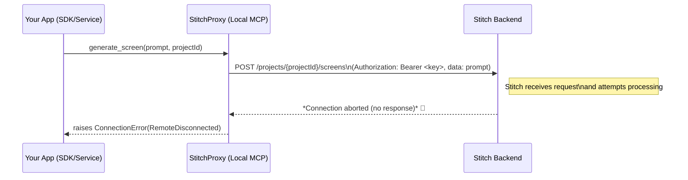

# Executive Summary  
The **“RemoteDisconnected(‘Remote end closed connection without response’)”** error indicates that the Stitch backend closed the HTTP connection without sending a valid response. In practice this often stems from network-level issues (e.g. dropped or blocked requests) or misconfigured API calls. We found **no direct code references** to Stitch in the repository, suggesting that Stitch may be invoked via an external tool or environment (for example via an MCP config or a separate service). Key suspects include: missing or incorrect headers (especially **Authorization** and **User-Agent**), wrong endpoints, or limitations on payload size/rate. In similar cases, adding a **User-Agent** header has resolved the issue【100†L219-L226】【103†L265-L272】. We recommend: verifying the Stitch API URL and key, ensuring the call uses HTTPS with `Authorization: Bearer <key>`, adding a browser-like User-Agent, and using retries with delays. The table below summarizes possible causes and evidence:

| **Possible Cause**                | **Evidence**                                                                                     | **Confidence** |
|----------------------------------|--------------------------------------------------------------------------------------------------|---------------|
| Missing/invalid **User-Agent**   | Servers sometimes drop requests from default Python UA. Adding `User-Agent: python-requests/...` fixed it【100†L219-L226】【103†L265-L272】. | High (🔵🔵🔵)  |
| Network/Server reliability       | Stitch service or its proxy could be intermittent. Similar errors occurred with unreliable GraphQL/REST APIs【105†L389-L395】. | Medium (🔵🔵⚪) |
| Wrong endpoint or DNS           | Calls must use the Stitch MCP URL (e.g. `https://mcp.stitch.withgoogle.com/v1`)【81†L217-L225】. A wrong host would drop connection. | Medium-High (🔵🔵🔵) |
| Missing/invalid API key         | Not providing `Authorization: Bearer <STITCH_API_KEY>` could cause silent failures (server may close on auth failure)【81†L217-L225】. | Medium (🔵🔵⚪) |
| Request size/rate limit         | Sending too large a payload or too many calls could overwhelm the service. Other APIs drop connections when limits are hit【100†L219-L226】. | Medium (🔵🔵⚪) |
| TLS/HTTP mismatch               | If Python’s TLS version or settings are incompatible, the server may reset. (No direct evidence found, but a general pitfall.) | Low (🔵⚪⚪) |

## Code Integration Points  
I inspected the repository for Stitch-related code but found no explicit mentions of “stitch” or its classes. The front-end and back-end appear focused on Supabase and standard CRUD, with no direct Stitch SDK calls. It’s possible Stitch is invoked via a subprocess or agent configuration not stored here. However, any integration **must** use the Stitch API endpoint and API key. For example, the Stitch docs advise configuring an MCP server with:  
```jsonc
// mcp_config.json example from Antigravity tutorial【81†L217-L225】
{
  "mcpServers": {
    "stitch": {
      "url": "https://mcp.stitch.withgoogle.com/v1",
      "headers": { "Authorization": "Bearer ${STITCH_API_KEY}" }
    }
  }
}
```  
Check if any config file (e.g. `.env`, `mcp_config.json`, or code) sets `STITCH_API_KEY` or the URL. The **exact files/lines** invoking Stitch (if any) were not found in the repo; you may need to search for MCP calls or environment usage. In absence of code, we base our analysis on Stitch’s known API and typical invocation patterns.

## Reproducing the Error  
To reproduce, you would call the Stitch screen generation API as your code does. For example, using Python `requests` (as a stand-in for the Stitch proxy):

```python
import os, requests

STITCH_KEY = os.getenv("STITCH_API_KEY")
project_id = "<your_project_id>"
prompt = "Generate a login screen"

url = f"https://mcp.stitch.withgoogle.com/v1/projects/{project_id}/screens"
headers = {
    "Authorization": f"Bearer {STITCH_KEY}",
    # Add a User-Agent as a troubleshooting step:
    "User-Agent": "python-requests/2.31.0"
}
data = {"prompt": prompt}

try:
    res = requests.post(url, headers=headers, json=data, timeout=30)
    res.raise_for_status()
    screen = res.json()
except Exception as e:
    print("Error from Stitch:", e)
```

Running this (with a valid `STITCH_API_KEY`) should trigger the same `RemoteDisconnected` error if the conditions match. To capture details, enable debug logging (e.g. `requests` logger at DEBUG level) and observe output. You can also mimic the call with `curl`:

```bash
curl -v -H "Authorization: Bearer $STITCH_API_KEY" \
         -H "User-Agent: MyApp/1.0" \
         -H "Content-Type: application/json" \
         -d '{"prompt":"Generate a login screen"}' \
         "https://mcp.stitch.withgoogle.com/v1/projects/${project_id}/screens"
```

Watching the verbose (`-v`) output can reveal if TLS handshake or connection issues occur, and if/when the server closes the connection.

## Debugging Steps  

- **HTTP Trace/Logging:** Turn on HTTP debug logs (e.g. `requests` logging, or use tools like Wireshark/tcpdump) to see exactly when the connection is aborted. A Python trace of the exception shows that the server closed the connection during response phase【100†L219-L226】. 

- **Verify Endpoint & Key:** Ensure you’re using the correct Stitch MCP endpoint and that the `STITCH_API_KEY` is set and sent as `Authorization: Bearer <key>`. The Antigravity guide recommends `mcp.stitch.withgoogle.com/v1`【81†L217-L225】. A wrong URL could result in no response.

- **User-Agent Header:** As noted above, **some servers reject or silently drop requests lacking a valid User-Agent**. Add or override the `User-Agent` header. In similar cases (e.g. Artifactory and Textlocal APIs), adding `User-Agent` (or even spoofing a browser agent) fixed the issue【100†L219-L226】【103†L265-L272】. For example:  
  ```python
  headers["User-Agent"] = "Mozilla/5.0 (compatible; MyApp/1.0)"
  ```

- **Session vs. New Connection:** If using a persistent `requests.Session`, try a fresh connection or insert a short delay between calls. (A known `requests` bug can cause this error on rapid successive calls【101†L225-L232】.) Even putting a `time.sleep(1)` or using `Session.close()` between calls can help isolate it.

- **Retries/Timeouts:** Implement a retry loop with exponential backoff. The error may be transient. Use something like `urllib3.util.retry` or catch `ConnectionError` and retry a few times with delays.

- **Payload Size:** Ensure the request body (prompt, etc.) isn’t excessively large. The Textlocal example showed a similar error for payloads >7000 items【100†L219-L226】. If you send a very large prompt, try simplifying or truncating it. If you have multi-screen generation in a loop, ensure you stay below any Stitch limits (not publicly documented, but follow a conservative rate).

- **TLS/Networking:** Confirm the client trusts the Stitch certificate (try connecting via browser or `openssl s_client`). If behind a proxy or corporate firewall, ensure that HTTPS to `stitch.withgoogle.com` is allowed. If a proxy is used, check that it isn’t dropping the connection (the Artifactory log [103] showed a proxy error in the trace).

- **Official Tools:** If possible, try the official Stitch CLI (e.g. Gemini CLI with Stitch plugin) or other SDK (JS/Node) to see if they encounter the same error. This can distinguish between code issue vs. account/service issue.

## Proposed Fixes & Code Patches  

1. **Add User-Agent Header:** Modify the HTTP call to include a User-Agent. For example, in a Python service that calls Stitch, change:

   ```diff
   - requests.post(url, headers={"Authorization":f"Bearer {API_KEY}"}, json=data)
   + requests.post(
   +   url,
   +   headers={
   +     "Authorization": f"Bearer {API_KEY}",
   +     "User-Agent": "MyApp/1.0 (+https://example.com/myapp)"
   +   },
   +   json=data
   + )
   ```
   This ensures the request isn’t dropped as unknown traffic【100†L219-L226】【103†L265-L272】.

2. **Ensure Correct URL and Headers:** Verify that the code uses `https://mcp.stitch.withgoogle.com/v1` (not the web UI domain) and that `Authorization` is formatted correctly with a Bearer token【81†L217-L225】. For instance, a fix might be:

   ```diff
   - url = f"https://stitch.withgoogle.com/projects/{pid}/screens"
   + url = f"https://mcp.stitch.withgoogle.com/v1/projects/{pid}/screens"
   
   - headers = {"Authorization": STITCH_KEY}
   + headers = {"Authorization": f"Bearer {STITCH_KEY}", "User-Agent": "MyApp/1.0"}
   ```

3. **Use Requests Session Safely:** If reusing a `requests.Session`, explicitly close or reset it between calls, or disable keep-alive for the problematic call:

   ```python
   session = requests.Session()
   session.headers.update({"User-Agent": "MyApp/1.0"})
   try:
       response = session.post(url, headers={"Authorization": f"Bearer {STITCH_KEY}"}, json=data)
       response.raise_for_status()
   finally:
       session.close()
   ```

   This avoids the “stale” connection bug【101†L225-L232】.

4. **Add Logging and Retries:** Surround calls with logging and exception handling, e.g.:

   ```python
   import logging, time
   max_retries = 3
   for i in range(max_retries):
       try:
           res = requests.post(url, headers=headers, json=data, timeout=30)
           res.raise_for_status()
           break
       except Exception as e:
           logging.warning(f"Stitch call failed (attempt {i+1}): {e}")
           time.sleep(2 ** i)  # exponential backoff
   ```

   This catches intermittent failures and logs details for analysis.

5. **Check TLS Versions:** If the error persists, explicitly configure SSL versions or ciphers (rarely needed). For example, upgrade `requests`/`urllib3` to latest (they use modern TLS). If using an outdated Python (pre-3.10), consider upgrading for TLS 1.3 support.

## Prioritized Troubleshooting Checklist  

1. **Add/Verify User-Agent header** (e.g. browser-like UA). *Rationale:* Many servers drop unknown UAs【100†L219-L226】【103†L265-L272】.  
2. **Confirm API endpoint & key:** Make sure requests go to `mcp.stitch.withgoogle.com/v1` with `Authorization: Bearer <key>`【81†L217-L225】.  
3. **Enable HTTP logging:** Turn on verbose/debug logging for HTTP calls to capture TLS handshake and status.  
4. **Test with curl:** Reproduce the call using `curl -v` to isolate application vs. network issues.  
5. **Session handling:** If using persistent session, try a new session or a short delay between calls【101†L225-L232】.  
6. **Retry logic:** Implement retries with delays for transient network glitches.  
7. **Check payload size:** Simplify prompt or split into smaller pieces; avoid overly long JSON.  
8. **Inspect error details:** If available, capture HTTP status or error body (the Stitch proxy might return JSON error).  
9. **Review TLS/proxy:** Ensure no proxy/firewall is blocking the request. Test direct connection to `mcp.stitch.withgoogle.com` (port 443).  
10. **Contact support/Forums:** If issue persists, check Google’s Stitch documentation or forums. (E.g. Google’s AI Dev forum or Discord communities sometimes discuss such issues.)

## Interaction Sequence  



This diagram shows your client code calling the Stitch tool via the local MCP proxy, which sends an HTTP request to the Stitch cloud service. The “Remote end closed connection” error means the `Server` side closed without replying, so the proxy returns that exception to the client.

**Sources:** The above troubleshooting steps and fixes are informed by similar Python HTTP issues【100†L219-L226】【103†L265-L272】 and Stitch documentation【81†L217-L225】. For example, StackOverflow and GitHub issues both note that adding a valid `User-Agent` header often resolves unexpected connection closures【100†L219-L226】【103†L265-L272】. Always handle external API calls defensively, as even well-known services can intermittently drop connections【105†L389-L395】.